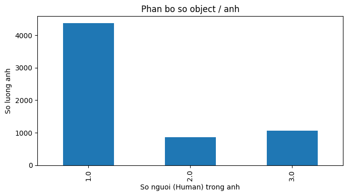
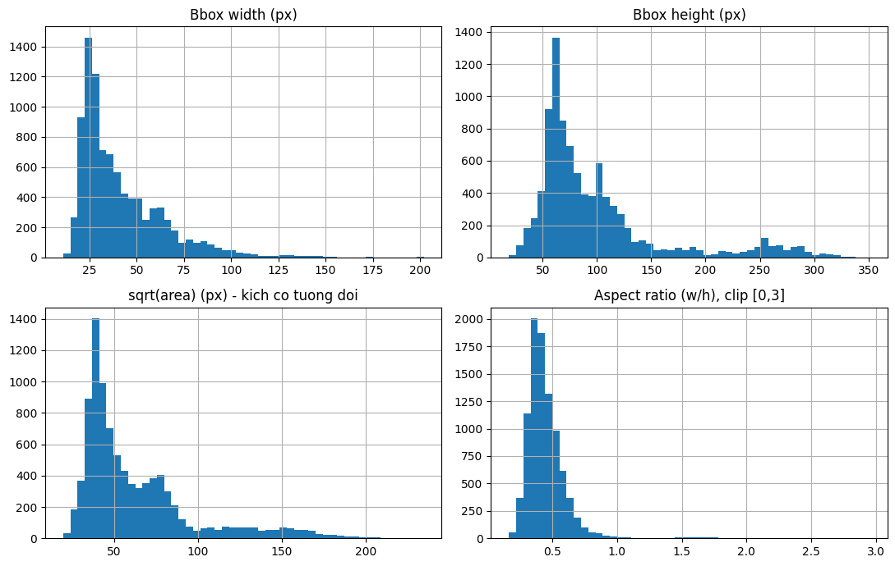
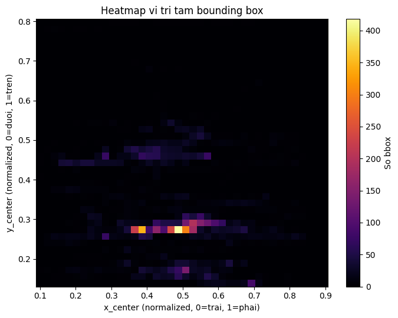
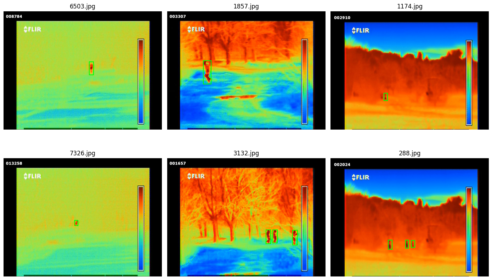
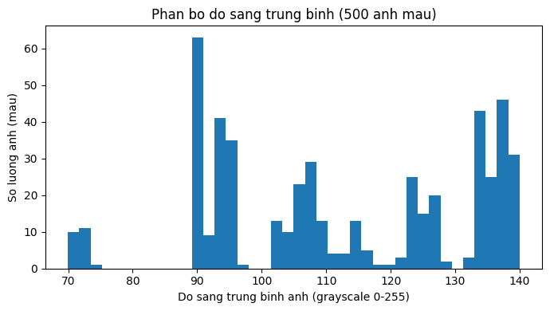

# Báo cáo phân tích dữ liệu (Dataset Analysis Report - EDA)

Sinh từ `notebooks/02_dataset_analysis.ipynb` (chạy lại ngày 2026-07-17, kernel `thermal_env`).
Nguồn annotation: `Anotations/All_In_One_Anot_Yolo/` (bộ **All_In_One**, quyết định trong `configs/dataset.yaml`).

## 1. Thiết lập

- Độ phân giải lấy từ config: 1280 x 960, class map: `{0: 'Human'}`
- Thư mục ảnh: `ALL_IN_ONE_RGB_IMG_ANOT/`
- Thư mục annotation YOLO (All_In_One): `ALL_IN_ONE_RGB_IMG_ANOT/Anotations/All_In_One_Anot_Yolo/`

## 2. Nạp annotation

- Số ảnh: 6.340 | Tổng số bounding box: **9.244**
- Ảnh thiếu file annotation (bộ All_In_One): **64**
- Ảnh có annotation nhưng 0 box (không có người trong khung): **0** -> mọi ảnh có annotation đều có ít nhất 1 người

## 3. Phân bố class và số object/ảnh

Dataset chỉ có 1 class (`Human`, 9.244 box) nên không có vấn đề mất cân bằng class.

| Thống kê số người/ảnh | Giá trị |
|---|---|
| count | 6.276 |
| mean | 1,47 |
| std | 0,77 |
| min | 1 |
| 25% | 1 |
| 50% (median) | 1 |
| 75% | 2 |
| max | 3 |

=> Mật độ người thấp: đa số ảnh chỉ có 1 người, tối đa 3 người/ảnh — không phải cảnh đông người.



## 4. Kích thước & tỷ lệ bounding box

| Thống kê (px) | w_px | h_px | area_px | aspect_ratio |
|---|---|---|---|---|
| count | 9.244 | 9.244 | 9.244 | 9.244 |
| mean | 41,5 | 98,7 | 5.232,3 | 0,450 |
| std | 22,5 | 60,3 | 6.749,5 | 0,174 |
| min | 11 | 19 | 392 | 0,165 |
| 25% | 25,8 | 61 | 1.564 | 0,354 |
| 50% | 34 | 77 | 2.516 | 0,418 |
| 75% | 52 | 111 | 5.712,8 | 0,506 |
| max | 202 | 351 | 54.944 | 2,950 |



**Nhận xét quan trọng từ hình dạng biểu đồ (không thể thấy chỉ từ bảng số liệu trên)**:

- Bbox **height** và **sqrt(area)** không phân bố đơn đỉnh (unimodal) mà có dạng **hai cụm (bimodal)**: cụm chính ở ~60-100px (height) / ~35-50px (sqrt-area), và một cụm phụ rõ rệt ở ~250-300px (height) / ~100-150px (sqrt-area). Đây là dấu hiệu dataset có **hai nhóm khoảng cách chụp khác nhau** (đa số người ở xa, một nhóm nhỏ hơn là người ở gần camera), không phải một dải liên tục.
- Bbox **width** giảm mượt dần từ đỉnh ~25-30px đến đuôi ~200px, không thấy cụm phụ rõ như height — chiều rộng người ít biến thiên theo khoảng cách hơn chiều cao.
- **Aspect ratio** tập trung rất chặt quanh 0,3-0,5 (median 0,418), đơn đỉnh, ít lệch — phù hợp dáng người đứng thẳng nhìn từ xa; đuôi kéo dài đến ~1,5-3 là thiểu số (tư thế khác hoặc bbox bị che khuất một phần).
- => Object trong ảnh chủ yếu **nhỏ** (sqrt-area trung bình 63px trên ảnh 1280x960, ~5% chiều rộng ảnh), cần lưu ý khi chọn anchor/scale cho detector (nên dùng kiến trúc multi-scale như FPN, hoặc YOLO với head độ phân giải cao) — và thiết kế anchor nên phủ cả 2 vùng scale (gần/xa), không chỉ tối ưu quanh giá trị trung bình.

## 5. Phân bố vị trí bbox trong khung hình



Heatmap tâm bbox (x_center, y_center normalized) cho biết vùng khung hình nào người thường xuất hiện — dùng để tham khảo khi thiết kế augmentation (crop/pad) hoặc ROI cho inference.

## 6. Ảnh mẫu kèm bounding box



6 ảnh mẫu ngẫu nhiên để kiểm tra trực quan: bbox khớp với vị trí người trong ảnh, không lệch.

## 7. Phân bố cường độ pixel (đặc trưng ảnh nhiệt)

Mẫu 500 ảnh (grayscale): mean = 112,5, std = 19,7, min = 70,0, max = 140,0



=> Khoảng dao động độ sáng khá hẹp (70-140/255) — không thấy nhóm ảnh cực sáng/cực tối tách biệt, nên **không đủ tín hiệu để suy luận ảnh chụp ngày/đêm** chỉ từ độ sáng trung bình (dataset cũng không có timestamp để đối chiếu — xem `dataset_intake_report.md`).

## 8. Tóm tắt

```
Số ảnh: 6.340 | Số bbox: 9.244
Object/ảnh: mean=1,47, median=1, max=3
Bbox area (sqrt): mean=63,3px, min=19,8px, max=234,4px
Ảnh không có người (0 box): 0
Ảnh thiếu annotation (bộ All_In_One): 64
```

## 9. Kết luận & việc cần lưu ý khi huấn luyện

1. **202 nhóm ảnh trùng lặp (MD5)** kế thừa từ notebook 01 vẫn còn trong tập này -> **bắt buộc dedupe trước khi chia train/val/test** (xem `03_preprocessing.ipynb`), nếu không sẽ rò rỉ dữ liệu (data leakage) giữa các tập.
2. Dùng đúng bộ annotation **All_In_One** (không dùng RGB) theo quyết định trong `configs/dataset.yaml`; 64 ảnh thiếu annotation trong bộ này cần quyết định xử lý (bỏ qua hay giữ làm negative sample).
3. **Object chủ yếu nhỏ, thuộc 2 cụm khoảng cách (gần/xa)** -> ảnh hưởng trực tiếp đến lựa chọn kiến trúc/anchor ở bước `04_model.ipynb`; nên ưu tiên kiến trúc hỗ trợ multi-scale detection cho vật thể nhỏ.
4. Mật độ người thấp (1-3/ảnh), single-class -> không có vấn đề mất cân bằng class, nhưng cần lưu ý mất cân bằng giữa "có người" (6.276 ảnh) và "không annotation" (64 ảnh) nếu đưa vào làm negative sample.
5. Không thể phân tích theo điều kiện chụp (ngày/đêm, thời tiết) do dataset thiếu metadata và độ sáng không đủ phân biệt rõ.
