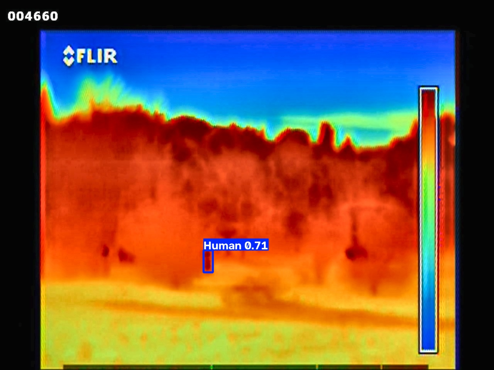

# Báo cáo inference & export (Inference Report)

Sinh từ `notebooks/07_inference.ipynb` (chạy ngày 2026-07-17, kernel `thermal_env`).

**Checkpoint dùng**: `outputs/checkpoints/best.pt` - vẫn là checkpoint **tạm 2-epoch smoke test** (xem
`reports/training_report.md`). Pipeline inference/export đã verify chạy đúng đầu-cuối, sẽ tự động dùng
checkpoint thật sau khi full training xong (không cần sửa code).

## 1. Chuẩn bị dữ liệu mẫu

`data/sample/` ban đầu trống - đã copy 8 ảnh ngẫu nhiên từ tập **test** (`data/processed/images/test`,
chưa từng dùng để train) sang để minh hoạ inference trên "ảnh mới".

## 2. Inference đơn ảnh

Ảnh `1497.jpg`: phát hiện 1 người, confidence 0,705. Kết quả (ảnh đã vẽ box) lưu tại
`outputs/predictions/demo_1497.jpg`.



## 3. Inference hàng loạt

Chạy trên toàn bộ 8 ảnh mẫu, lưu ảnh đã vẽ box vào `outputs/predictions/` + bảng tổng hợp `summary.csv`:

| Ảnh | Số người | Max confidence | Mean confidence |
|---|---|---|---|
| 1497.jpg | 1 | 0,705 | 0,705 |
| 2979.jpg | 1 | 0,739 | 0,739 |
| 3492.jpg | 4 | 0,901 | 0,725 |
| 3549.jpg | 2 | 0,909 | 0,878 |
| 4740.jpg | 1 | 0,723 | 0,723 |
| 4975.jpg | 1 | 0,850 | 0,850 |
| 5011.jpg | 1 | 0,643 | 0,643 |
| 6803.jpg | 1 | 0,708 | 0,708 |

Tất cả 8 ảnh đều phát hiện được ít nhất 1 người, confidence trong khoảng hợp lý (0,64-0,91) - phù hợp với
`conf_threshold=0.15` khá thấp (ưu tiên recall theo `configs/inference.yaml`).

## 4. Export ONNX

Export thành công sang `outputs/checkpoints/best.onnx` (44,7 MB, opset 20). Ultralytics tự động cài các
gói cần thiết (`onnx`, `onnxruntime`, `onnxslim`) khi export lần đầu.

**Lý do export ONNX**: chạy được bằng ONNX Runtime mà không cần cài đầy đủ PyTorch/ultralytics - phù hợp
triển khai lên edge device hoặc tích hợp vào hệ thống camera an ninh thực tế (không nhất thiết dùng Python).

Lệnh dùng để chạy thử ONNX (ultralytics tự in ra sau khi export):
```bash
yolo predict task=detect model=outputs/checkpoints/best.onnx imgsz=640
```

## 5. Code liên quan

- `src/inference/predictor.py` - `load_predictor()`, `predict_image()`, `save_annotated()`
- `src/inference/batch_predict.py` - `batch_predict()` xử lý hàng loạt + sinh `summary.csv`
- `src/inference/export.py` - `export_model()` xuất ONNX (hoặc format khác nếu cần sau này)

## 6. Việc cần làm sau khi full training thật xong

1. Chạy lại `07_inference.ipynb` - tự động dùng `outputs/checkpoints/best.pt` mới, export lại
   `best.onnx` mới tương ứng.
2. Test lại trên ảnh/video thật từ camera nhiệt (nếu có) thay vì chỉ ảnh từ tập test có sẵn.
3. Nếu triển khai thực tế lên edge device, benchmark tốc độ inference ONNX vs PyTorch trên thiết bị đích.
