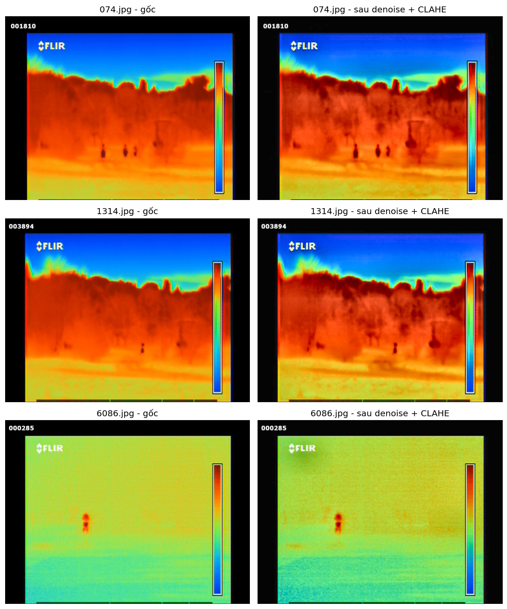

# Báo cáo tiền xử lý dữ liệu (Preprocessing Report)

Sinh từ `notebooks/03_preprocessing.ipynb` (chạy ngày 2026-07-17, kernel `thermal_env`).
Kế thừa quyết định từ `reports/dataset_intake_report.md` và `reports/dataset_analysis_report.md`.

## 1. Mục tiêu

Chuẩn bị dữ liệu sẵn sàng cho training YOLOv8 (`configs/model.yaml`): loại bỏ dữ liệu không tin cậy,
dedupe, chia train/val/test, xuất ra cấu trúc chuẩn tại `data/processed/`.

## 2. Các bước xử lý & quyết định

| Bước | Quyết định | Lý do |
|---|---|---|
| Loại ảnh thiếu annotation | Loại bỏ hẳn 64 ảnh, **không** dùng làm negative sample | Thiếu file annotation khác với annotation rỗng đã xác nhận 0 box — không có căn cứ để khẳng định ảnh đó thực sự không có người |
| Dedupe | Mỗi nhóm MD5 trùng nhau chỉ giữ 1 đại diện (tên file nhỏ nhất) | Tránh cùng một ảnh vật lý xuất hiện ở cả train và val/test -> data leakage khiến mAP đánh giá bị ảo cao |
| Chia split | Random shuffle (seed 42) theo tỷ lệ 80/10/10 từ `configs/dataset.yaml` | Single-class, mật độ người thấp và đồng đều (xem `dataset_analysis_report.md`) nên không cần stratify theo class |
| Định dạng xuất | Copy ảnh + label vào `images/{split}` + `labels/{split}` (chuẩn Ultralytics), sinh `data.yaml` | Để `04_model.ipynb`/`05_training.ipynb` load thẳng bằng `ultralytics.YOLO(...).train(data="data/processed/data.yaml")`, không cần viết loader riêng |

## 3. Kết quả

```
Ảnh gốc: 6.340
  - Loại bỏ (thiếu annotation All_In_One): 64
  - Loại bỏ (trùng lặp MD5): 215
  - Còn lại để train/val/test: 6.061
Train / Val / Test: 4.849 / 606 / 606
```

**Lưu ý về con số trùng lặp**: 215 ảnh trùng bị loại ở đây, khác với "218 file" trong `dataset_intake_report.md`,
vì report đó tính dedupe trên toàn bộ 6.340 ảnh, còn ở đây dedupe chỉ tính trên 6.276 ảnh hợp lệ (đã loại 64 ảnh
thiếu annotation trước) — một vài cặp trùng lặp có 1 ảnh nằm trong nhóm bị loại đó nên không còn tính là cặp trùng nữa.

### Ảnh trước/sau tăng cường (denoise + CLAHE)



3 ảnh mẫu ngẫu nhiên - cột trái là ảnh gốc, cột phải là sau bilateral denoise + CLAHE trên kênh L. Có thể
thấy tương phản vùng người/nền được tăng lên rõ rệt mà không làm lệch màu palette gốc.

## 4. Output

- `data/processed/images/{train,val,test}/` + `data/processed/labels/{train,val,test}/` — ảnh và label YOLO đã sẵn sàng
- `data/processed/data.yaml` — file cấu hình chuẩn Ultralytics (path, train/val/test, nc=1, names=[Human])
- `data/processed/manifest.csv` — truy vết toàn bộ 6.340 ảnh gốc, mỗi dòng ghi rõ ảnh đó: giữ lại (kèm split) hay bị loại (kèm lý do: `excluded_missing_annotation` hoặc `dropped_duplicate_of:<file>`)

## 5. Kiểm tra đã thực hiện (sanity check)

- **Không rò rỉ dữ liệu**: xác nhận 0 MD5 trùng giữa train/val/test (train-val, train-test, val-test đều 0 overlap)
- **Số file khớp kỳ vọng**: mỗi split có số ảnh = số label = số lượng đã tính trước khi copy
- Tất cả assertion trong notebook đều pass, không có ngoại lệ khi chạy end-to-end

## 6. Việc cần lưu ý ở bước tiếp theo (04_model.ipynb / 05_training.ipynb)

1. Load dataset trực tiếp qua `data/processed/data.yaml`, không cần parse annotation thủ công nữa.
2. Object nhỏ, 2 cụm khoảng cách gần/xa (theo `dataset_analysis_report.md`) -> ban đầu định giữ `image_size: [1280, 960]`, nhưng **đã đổi xuống `[640, 640]`** do giới hạn GPU 6GB VRAM (xem `reports/training_report.md`).
3. Nếu sau này cần thêm dữ liệu (ví dụ dataset mới), phải chạy lại pipeline dedupe theo đúng logic ở đây để tránh trùng lặp giữa các nguồn.
4. `manifest.csv` là nguồn tham chiếu duy nhất cho biết ảnh nào đã bị loại và vì sao — dùng để audit lại nếu nghi ngờ kết quả training bất thường.
