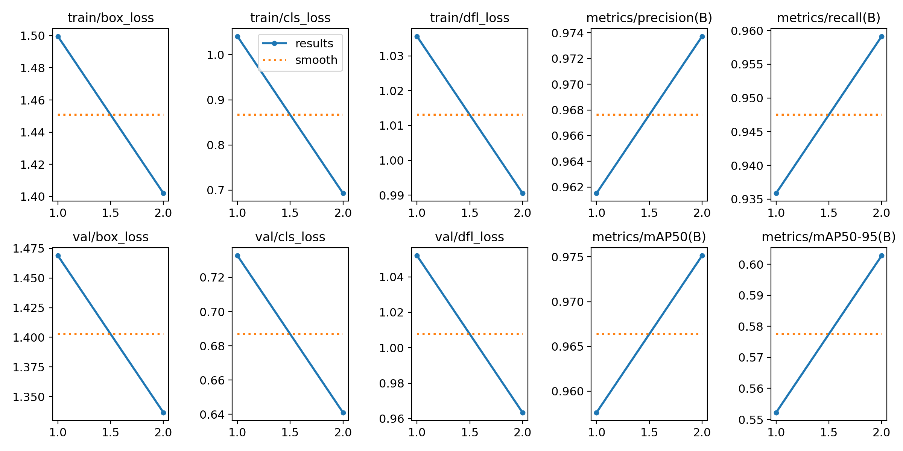
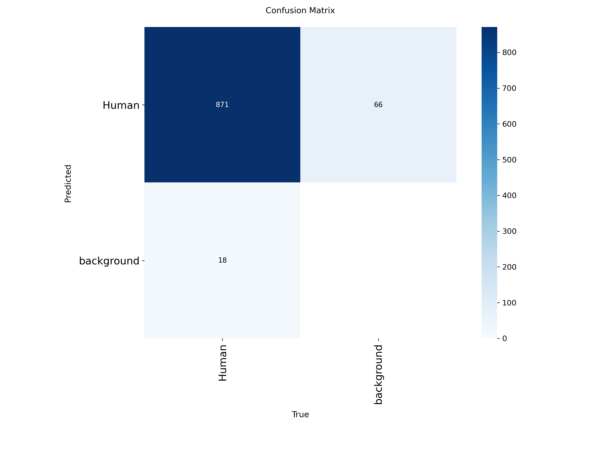
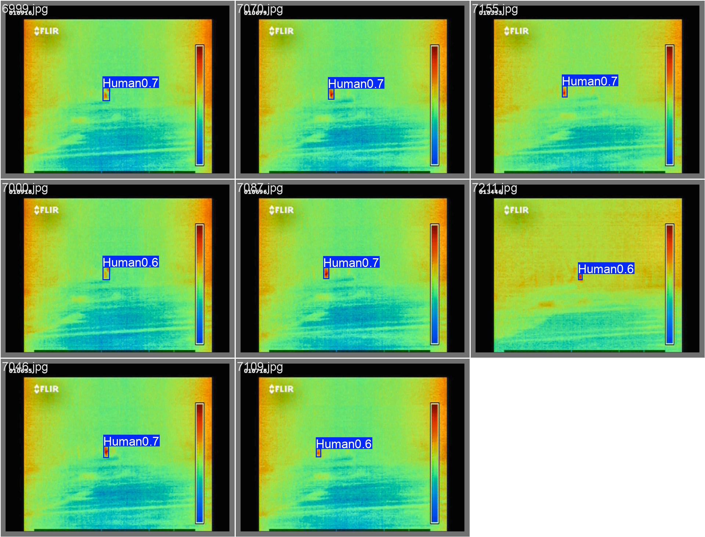

# Báo cáo training (Training Report)

Sinh từ `notebooks/05_training.ipynb` (chạy ngày 2026-07-17, kernel `thermal_env`).
**Full training chưa chạy** - báo cáo này ghi lại setup, smoke test, và các quyết định/vấn đề đã xử lý
để chạy full training sau.

## 1. Cấu hình training

Theo `configs/training.yaml` + `configs/model.yaml`:

| Hạng mục | Giá trị |
|---|---|
| Model | YOLOv8s, pretrained COCO |
| Epochs (dự kiến) | 100 |
| Batch size | `-1` (autobatch - xem mục 3) |
| Image size | **640x640** (đã đổi từ 1280x960 - xem mục 2) |
| Optimizer | AdamW, lr=0.001, weight_decay=0.0005 |
| Scheduler | Cosine, warmup 3 epoch |
| Early stopping | patience=15 |
| AMP (mixed precision) | Bật |

## 2. Sự cố GPU OOM và quyết định đổi imgsz 1280 -> 640

Quyết định ban đầu (`docs/architecture.md`, chốt 2026-07-17) là giữ nguyên resolution gốc 1280x960 khi
train, vì object nhỏ (người ở xa camera). Thực tế thử nghiệm phát hiện:

1. GPU RTX 3060 Laptop **6GB VRAM bị OOM (out of memory) ở `imgsz=1280`** - kể cả khi thử giảm dần batch
   (16 -> 8 -> 4) và kể cả dùng `batch=-1` (autobatch) của ultralytics tự dò bộ nhớ.
2. Phát hiện quan trọng hơn: **một khi CUDA báo OOM, toàn bộ CUDA context của tiến trình Python đó bị hỏng**
   - kể cả gọi `torch.cuda.empty_cache()` ngay sau đó cũng lỗi theo (`AcceleratorError: CUDA error: out of
   memory`). Vì vậy không thể tự retry với batch nhỏ hơn trong cùng 1 process - cách retry thủ công ban đầu
   không hoạt động, phải khởi động lại kernel (process) hoàn toàn mới cho mỗi lần thử.
3. Đã hỏi ý kiến người dùng và **quyết định giảm xuống `imgsz=640`** (thay vì thử imgsz trung gian hoặc đổi
   model nhỏ hơn) - tổ hợp chuẩn, đã kiểm chứng rộng rãi, chắc chắn chạy được trên GPU 6GB.

**Đánh đổi**: giảm chi tiết ảnh khi train (640 vs 1280 gốc) có thể ảnh hưởng khả năng phát hiện người ở xa/
bbox nhỏ - cần theo dõi kỹ ở `06_evaluation.ipynb` (so sánh recall theo kích thước bbox, đặc biệt nhóm bbox
nhỏ đã xác định ở `dataset_analysis_report.md`).

Đã cập nhật `configs/model.yaml`, `configs/training.yaml`, `configs/inference.yaml`, `docs/architecture.md`
ghi rõ thay đổi này và lý do.

## 3. Batch size: dùng autobatch (`batch=-1`)

`configs/training.yaml` khai báo `batch_size: 16` nhưng đây chỉ còn là giá trị lịch sử/tham khảo - **thực tế
luôn gọi `model.train(batch=-1, ...)`** để ultralytics tự dò dung lượng GPU trống và chọn batch an toàn
trước khi train thật, tránh lặp lại sự cố OOM ở mục 2. Ở `imgsz=640`, autobatch chọn **batch=4** cho GPU này.

## 4. Kết quả smoke test (2 epoch, đã chạy thật)

| Hạng mục | Giá trị |
|---|---|
| Trạng thái | **PASS** - không OOM, data loader/checkpoint/log hoạt động đúng |
| Batch (autobatch) | 4 |
| Tốc độ | ~149,7 giây/epoch (2 epoch trong 299,3s) |
| Precision | 0,974 |
| Recall | 0,959 |
| mAP50 | 0,975 |
| mAP50-95 | 0,603 |

**Lưu ý quan trọng**: các chỉ số P/R/mAP ở trên chỉ sau 2 epoch fine-tune, cao bất thường vì checkpoint
pretrained COCO đã biết class "person" từ trước (gần giống class `Human` của dataset này) - **đây KHÔNG
phải kết quả cuối cùng**, chỉ xác nhận pipeline chạy đúng đầu-cuối trước khi cam kết chạy full training.

Kết quả smoke test lưu tại `outputs/logs/yolov8s_thermal_smoke/`.

### Biểu đồ training (smoke test, chỉ 2 epoch - sẽ được thay bằng 100 epoch thật)







Các biểu đồ này do ultralytics tự sinh trong `outputs/logs/yolov8s_thermal_smoke/` - chỉ 2 epoch nên
đường loss/metric gần như chưa hội tụ, sẽ được thay bằng biểu đồ 100-epoch thật sau khi full training xong.

## 5. Ước tính thời gian full training

Với tốc độ đo được (~150s/epoch) và 100 epoch theo config:

```
100 epoch x ~150s/epoch ≈ 4,2 giờ
```

Có thể kết thúc sớm hơn nếu early stopping kích hoạt (patience=15 epoch không cải thiện fitness).

## 6. Trạng thái hiện tại: CHƯA chạy full training

Theo yêu cầu, **full training bị hoãn lại chạy sau**. Tuy nhiên đã copy tạm checkpoint từ smoke test
(`outputs/logs/yolov8s_thermal_smoke/weights/best.pt`, chỉ 2 epoch) sang `outputs/checkpoints/best.pt`
để có thể chạy thử `06_evaluation.ipynb`/`07_inference.ipynb` end-to-end ngay bây giờ. Đã verify checkpoint
này load đúng (`model.names` = `{0: 'Human'}`, không còn 80 class COCO gốc) và predict ra box hợp lý trên
ảnh validation.

**QUAN TRỌNG**: đây là checkpoint tạm 2 epoch, không phải kết quả training thật - chỉ số P/R/mAP ở mục 4
không phản ánh chất lượng model thật sự (dataset nhỏ, 2 epoch quá ít để đánh giá). Khi full training thật
xong, `outputs/checkpoints/best.pt` sẽ **bị ghi đè tự động** bởi checkpoint 100-epoch thật (xem cell full
training ở `05_training.ipynb`) - không cần thao tác thủ công gì thêm.

Để chạy full training thật khi sẵn sàng:

1. Mở `notebooks/05_training.ipynb`
2. Ở cell mục "4. Full training", đổi `RUN_FULL_TRAINING = False` thành `RUN_FULL_TRAINING = True`
3. Chạy notebook - quá trình sẽ mất ước tính ~4,2 giờ, dùng `batch=-1` (autobatch) như smoke test
4. Sau khi xong, `best.pt` được tự động copy sang `outputs/checkpoints/best.pt` (khớp với
   `configs/inference.yaml -> checkpoint`)
5. Kết quả (weights, results.csv, plot, tensorboard log) lưu tại `outputs/logs/yolov8s_thermal/`

## 7. Việc cần lưu ý khi chạy full training thật

1. Theo dõi `patience=15` early stopping - nếu dừng quá sớm (trước epoch ~30-40), có thể cần giảm patience
   hoặc kiểm tra learning rate/schedule.
2. Do đổi `imgsz` 1280 -> 640, cần đặc biệt chú ý recall trên nhóm bbox nhỏ khi đánh giá ở
   `06_evaluation.ipynb` - đây là đánh đổi trực tiếp từ quyết định ở mục 2.
3. `early_stopping.monitor: val_map50` trong config không khớp hoàn toàn với cơ chế nội bộ của ultralytics
   (dùng "fitness" - kết hợp mAP50 và mAP50-95 có trọng số, không phải mAP50 đơn thuần) - xem ghi chú trong
   `05_training.ipynb` mục 1.
4. Laptop cần cắm sạc và tránh sleep/hibernate trong suốt ~4,2 giờ training.
